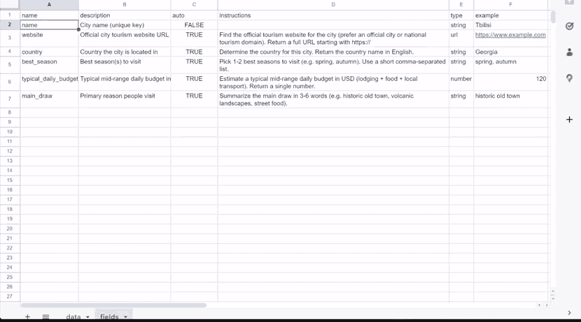

# mcp-sheet-filler

MCP server for storing and safely auto-filling tabular data. Provides tools for an AI agent to read objects, identify empty auto-fill fields, collect values, and write them back — without overwriting existing data.



[demo sheet](https://docs.google.com/spreadsheets/d/1ksOx-MvgoLr-RZ3k-Ij6vx2InpL0C9owXkd_XSxEiyI/edit?usp=sharing)

## Installation

```bash
npm install
npm run build
```

## Configuration

### Environment Variables

| Variable | Description | Default |
|----------|-------------|---------|
| `OBJECT_KEY_FIELD` | Key field name for objects | `name` |

**Google Sheets:**

| Variable | Description | Default |
|----------|-------------|---------|
| `GOOGLE_SHEET_ID` | Google Sheet ID | — |
| `SHEET_TAB_DATA` | Data sheet name | `data` |
| `SHEET_TAB_FIELDS` | Fields schema sheet name | `fields` |
| `GOOGLE_SERVICE_ACCOUNT_KEY` | Service account JSON (string or file path) | — |

### Google Sheets Setup

1. Create a Google Cloud project and enable the Google Sheets API
2. Create a service account and download the JSON key
3. Share your Google Sheet with the service account email (with Editor access)
4. Set `GOOGLE_SERVICE_ACCOUNT_KEY` to the JSON content or file path

**Sheet structure:**

- `fields` sheet: columns `name`, `description`, `auto`, `instructions`, `type`, `example`
- `data` sheet: first row is headers (field names), first column is the object key, each subsequent row is an object

## Usage

### With Claude Desktop

Add to `claude_desktop_config.json`:

```json
{
  "mcpServers": {
    "sheet-filler": {
      "command": "node",
      "args": ["/path/to/mcp-sheet-filler/dist/index.js"],
      "env": {
        "GOOGLE_SHEET_ID": "your-google-sheet-id",
        "GOOGLE_SERVICE_ACCOUNT_KEY": "/path/to/service-account.json"
      }
    }
  }
}
```

### Development

```bash
npm run dev    # Run with tsx
npm run build  # Build TypeScript
npm start      # Run built version
npm test       # Run tests
```

## Data Model

### Fields

Schema for object fields, stored in `fields` table/sheet:

| Column | Type | Description |
|--------|------|-------------|
| `name` | string | Unique field name (required) |
| `description` | string | Field description |
| `auto` | boolean | Auto-fill flag |
| `instructions` | string | Instructions for auto-filling |
| `type` | string | Data type for validation |
| `example` | string | Example value |

### Objects

Data objects stored in `data` table/sheet. Each row is an object, each column is a field. Objects are identified by their key field (`OBJECT_KEY_FIELD`, default: `name`).

### Supported Types

- `string` (default)
- `number`
- `date` (ISO-8601: `YYYY-MM-DD`)
- `datetime` (ISO-8601)
- `url`
- `email`
- `json`
- `enum:val1|val2|val3`

### Empty Value Rules

A value is considered empty if it is: `null`, `undefined`, empty string, or whitespace-only.

Values like `0`, `false`, `"0"` are **not** empty.

## MCP Tools

### filler_init

Initialize the current spreadsheet by creating `data` and `fields` tabs with header rows. Errors if either tab already exists. No parameters required.

```json
{}
```

Returns `{ success, fieldsTab, dataTab, keyField }`.

### filler_list_fields

List all fields or a subset.

```json
{ "names": ["field1", "field2"], "include_instructions": true }
```

### filler_get_fields_by_names

Get field metadata by names.

```json
{ "names": ["field1", "field2"] }
```

### filler_add_field

Add a new field.

```json
{
  "field": {
    "name": "website",
    "description": "Company website",
    "auto": true,
    "type": "url",
    "instructions": "Find the official website"
  }
}
```

### filler_get_object / filler_get_object_by_name

Get an object by its key.

```json
{ "name": "Acme Corp" }
```

### filler_add_object_by_name

Create a new object.

```json
{ "name": "Acme Corp" }
```

### filler_save_object_no_overwrite

Save field values without overwriting non-empty fields.

```json
{
  "name": "Acme Corp",
  "values": {
    "website": "https://acme.com",
    "founded": "1990"
  }
}
```

Returns status for each field:
- `saved` — value was saved
- `skipped_already_set` — field already has a value
- `rejected_unknown_field` — field not in schema
- `rejected_invalid_type` — value failed type validation

### filler_get_missing_auto_fields

Get empty auto-fill fields for an object.

```json
{ "name": "Acme Corp", "include_field_meta": true }
```

### filler_get_next_missing_fields_object

Get the first object that has missing auto-fill fields.

```json
{ "include_field_meta": true }
```

Returns `{ found, object, missing }` — use this to process objects one by one.

## Workflow Example

1. Agent calls `filler_list_fields` to understand the schema
2. Agent calls `filler_get_object_by_name` to read an object
3. Agent calls `filler_get_missing_auto_fields` to find what needs filling
4. Agent collects values using instructions from field metadata
5. Agent calls `filler_save_object_no_overwrite` to save values safely

## Error Codes

| Code | Description |
|------|-------------|
| `backend_not_configured` | Storage backend not configured |
| `field_already_exists` | Field with this name already exists |
| `field_not_found` | Field not found |
| `object_already_exists` | Object with this name already exists |
| `object_not_found` | Object not found |
| `invalid_argument` | Invalid argument provided |
| `storage_error` | Storage operation failed |

## License

ISC
