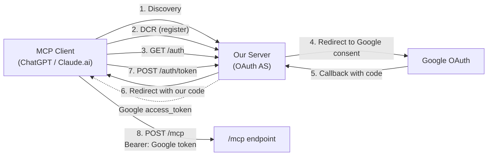
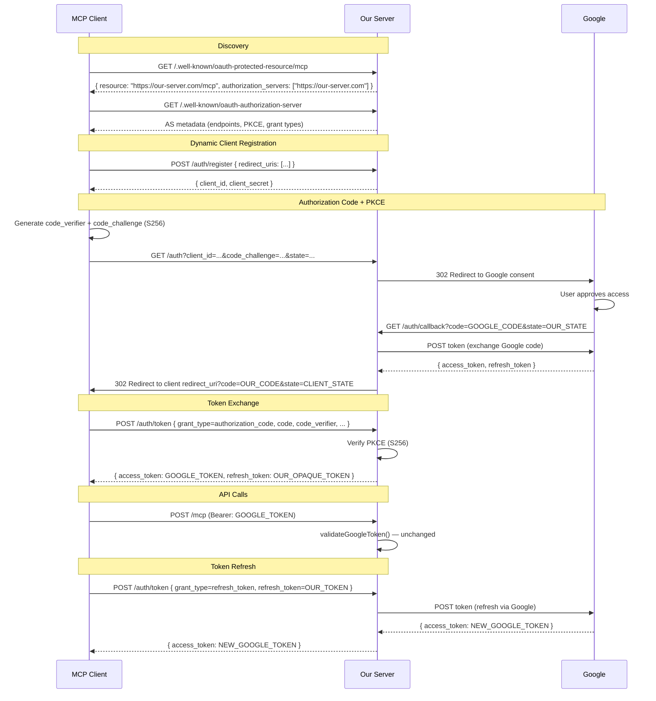
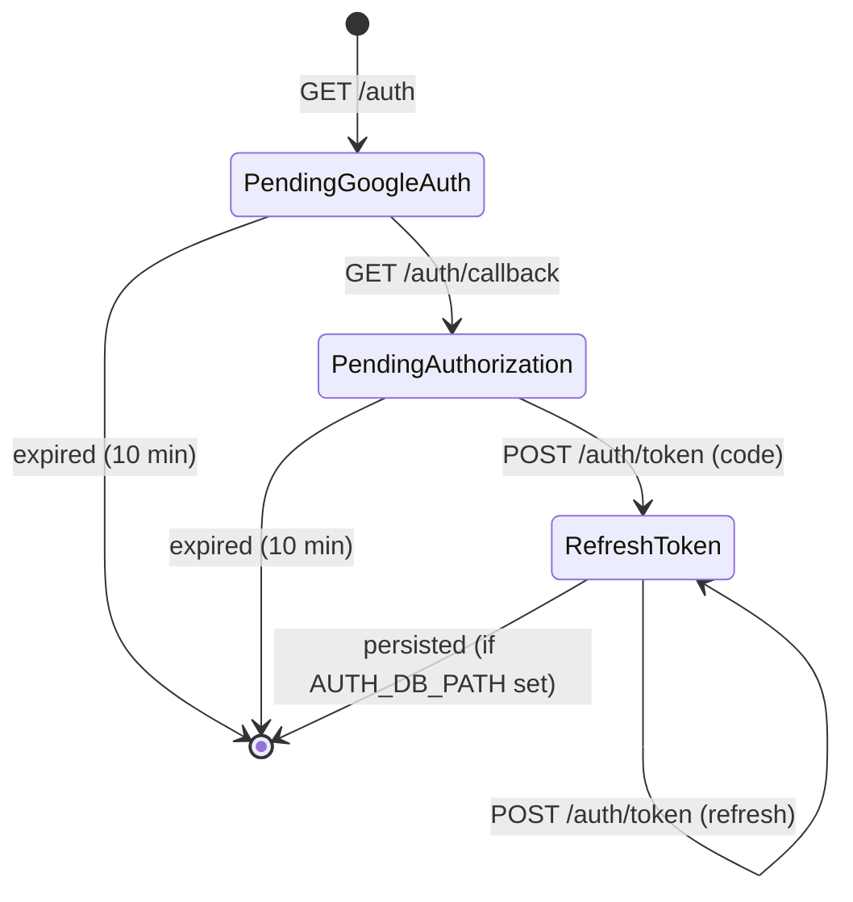

# OAuth Authorization Server

The MCP Sheet Filler server includes a built-in OAuth 2.0 Authorization Server that acts as an intermediary between MCP clients (ChatGPT, Claude.ai, etc.) and Google OAuth. This enables clients that require standard OAuth Authorization Code flow with PKCE and Dynamic Client Registration (DCR) to authenticate seamlessly.

## Why

Claude Desktop can store Google OAuth tokens locally and send them as bearer tokens. However, **ChatGPT and Claude.ai MCP connectors** require the MCP server itself to implement a full OAuth 2.0 Authorization Code flow. This authorization server bridges that gap: clients authenticate with us using standard OAuth, we authenticate with Google behind the scenes, and pass through the Google access token.

The existing `/mcp` bearer token validation is unchanged -- the token remains a Google access token.

## Architecture



## Full OAuth Flow



## Endpoints

| Method | Path | Auth | Description |
|--------|------|------|-------------|
| GET | `/.well-known/oauth-authorization-server` | No | RFC 8414 AS metadata |
| POST | `/auth/register` | No | Dynamic Client Registration (RFC 7591) |
| GET | `/auth` | No | Authorization endpoint -- redirects to Google consent |
| GET | `/auth/callback` | No | Google OAuth callback -- redirects to client with our code |
| POST | `/auth/token` | No* | Token exchange (authorization_code + PKCE) and refresh grant |

*Client authenticates via `client_id` / `client_secret` in the request body (`client_secret_post`).

### GET `/.well-known/oauth-authorization-server`

Returns RFC 8414 Authorization Server Metadata:

```json
{
  "issuer": "https://your-server.com",
  "authorization_endpoint": "https://your-server.com/auth",
  "token_endpoint": "https://your-server.com/auth/token",
  "registration_endpoint": "https://your-server.com/auth/register",
  "response_types_supported": ["code"],
  "grant_types_supported": ["authorization_code", "refresh_token"],
  "token_endpoint_auth_methods_supported": ["client_secret_post"],
  "code_challenge_methods_supported": ["S256"]
}
```

### POST `/auth/register`

Register a new OAuth client:

```bash
curl -X POST https://your-server.com/auth/register \
  -H 'Content-Type: application/json' \
  -d '{"redirect_uris": ["https://app.example.com/callback"]}'
```

Response (201):
```json
{
  "client_id": "a1b2c3d4-...",
  "client_secret": "6f8a9b...",
  "redirect_uris": ["https://app.example.com/callback"],
  "token_endpoint_auth_method": "client_secret_post"
}
```

### GET `/auth`

Authorization endpoint. Query parameters:

| Parameter | Required | Description |
|-----------|----------|-------------|
| `client_id` | Yes | From DCR |
| `redirect_uri` | Yes | Must match DCR registration |
| `code_challenge` | Yes | PKCE S256 challenge |
| `code_challenge_method` | No | Must be `S256` (default) |
| `state` | Yes | Opaque client state |
| `response_type` | No | Must be `code` (default) |

Redirects (302) to Google OAuth consent screen.

### GET `/auth/callback`

Internal endpoint. Google redirects here after user consent. The server exchanges the Google authorization code for tokens, then redirects (302) to the client's `redirect_uri` with our authorization code and the client's original state.

### POST `/auth/token`

#### Authorization Code Grant

```bash
curl -X POST https://your-server.com/auth/token \
  -H 'Content-Type: application/json' \
  -d '{
    "grant_type": "authorization_code",
    "code": "OUR_AUTH_CODE",
    "client_id": "...",
    "client_secret": "...",
    "redirect_uri": "https://app.example.com/callback",
    "code_verifier": "ORIGINAL_PKCE_VERIFIER"
  }'
```

Response:
```json
{
  "access_token": "ya29.GOOGLE_ACCESS_TOKEN",
  "token_type": "Bearer",
  "expires_in": 3600,
  "refresh_token": "OUR_OPAQUE_REFRESH_TOKEN"
}
```

#### Refresh Token Grant

```bash
curl -X POST https://your-server.com/auth/token \
  -H 'Content-Type: application/json' \
  -d '{
    "grant_type": "refresh_token",
    "refresh_token": "OUR_OPAQUE_REFRESH_TOKEN",
    "client_id": "...",
    "client_secret": "..."
  }'
```

Response:
```json
{
  "access_token": "ya29.NEW_GOOGLE_ACCESS_TOKEN",
  "token_type": "Bearer",
  "expires_in": 3600
}
```

## Configuration

The authorization server reuses the existing HTTP transport config, plus one optional variable for persistence:

| Variable | Required | Description |
|----------|----------|-------------|
| `RESOURCE_URL` | Yes | Public URL of this server. Used as the AS issuer and for building redirect URIs. |
| `GOOGLE_OAUTH_CLIENT_ID` | Yes | Google OAuth 2.0 client ID. Used for both client audience validation and Google consent. |
| `GOOGLE_OAUTH_CLIENT_SECRET` | Yes | Google OAuth 2.0 client secret. Used for Google token exchange. |
| `TRANSPORT` | Yes | Must be `http` to enable the authorization server. |
| `AUTH_DB_PATH` | No | Path to SQLite database file for OAuth persistence. Default: `:memory:` (no persistence). Set to a file path (e.g., `data/auth.db`) to survive restarts. |

### Google Cloud Console Setup

Your OAuth client in Google Cloud Console must be configured as a **Web application** with:

- **Authorized redirect URIs**: `${RESOURCE_URL}/auth/callback`

Example: if `RESOURCE_URL=https://mcp.example.com`, add `https://mcp.example.com/auth/callback`.

## State Storage

| Store | Contents | TTL | Storage |
|-------|----------|-----|---------|
| `registeredClients` | DCR-registered client credentials | None | SQLite (configurable via `AUTH_DB_PATH`) |
| `refreshTokens` | Our opaque token mapped to Google refresh token | None | SQLite (configurable via `AUTH_DB_PATH`) |
| `pendingGoogleAuths` | State between `/auth` redirect and `/auth/callback` | 10 minutes | In-memory |
| `pendingAuthorizations` | Authorization codes awaiting token exchange | 10 minutes | In-memory |

By default (`AUTH_DB_PATH` unset or `:memory:`), all stores are in-memory and a server restart clears everything. Set `AUTH_DB_PATH` to a file path to persist `registeredClients` and `refreshTokens` across restarts.

A cleanup job runs every 5 minutes to remove expired `pendingGoogleAuths` and `pendingAuthorizations` entries.



## Security

- **PKCE S256 enforced** -- `plain` method is rejected
- **Authorization codes are single-use** -- a second exchange attempt fails
- **10-minute TTL** on authorization codes and pending auth states
- **State parameters** are cryptographically random (`crypto.randomBytes`)
- **Client credentials** validated on every token request
- **Redirect URI** must exactly match the URI registered during DCR
- **Refresh token isolation** -- each refresh token is bound to the client that created it
- **SQLite persistence** optional via `AUTH_DB_PATH` -- only stores client registrations and refresh token mappings; ephemeral auth state remains in-memory

## Verification

Start the server and test the endpoints:

```bash
RESOURCE_URL=http://localhost:3000 TRANSPORT=http npm run dev:http
```

```bash
# Protected Resource Metadata (points to our AS)
curl http://localhost:3000/.well-known/oauth-protected-resource/mcp

# Authorization Server Metadata
curl http://localhost:3000/.well-known/oauth-authorization-server

# Dynamic Client Registration
curl -X POST http://localhost:3000/auth/register \
  -H 'Content-Type: application/json' \
  -d '{"redirect_uris":["http://localhost:8080/callback"]}'
```
